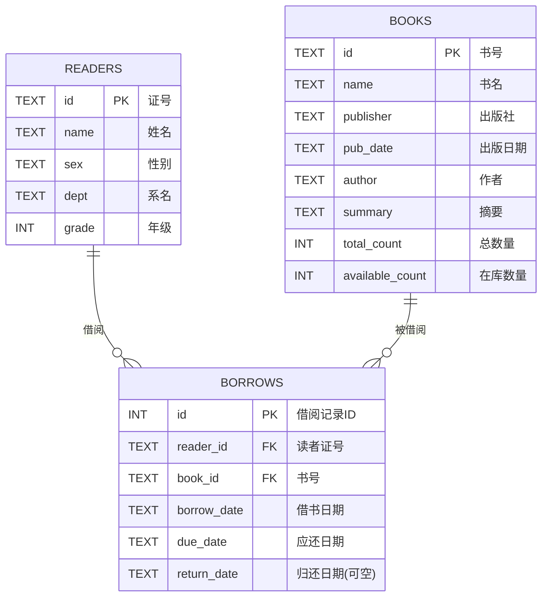

# Library Management System (Database Principles Coursework)

<p align="center">
  
  
  
  
</p>

## 项目简介

本项目是《数据库原理》课程实验“图书馆管理系统”的 Node.js 实现，覆盖教师要求的 14 个功能项（图书管理、读者管理、借还流程、超期查询等）。

- **后端框架**：自定义轻量中间件框架 `WebApp.js`
- **数据库**：`SQLite`（文件名固定为 `lib.db`）
- **接口风格**：`POST` 表单提交，HTML 页面结果返回（符合课程测试页面要求）

---

## 功能清单（14 项）

### 1) 数据库初始化

- 初始化数据库结构（`books`、`readers`、`borrows`）

### 2) 图书相关（5 项）

- 添加新书
- 增加书籍数量
- 删除/减少书籍
- 修改书籍信息
- 查询书籍

### 3) 读者相关（5 项）

- 添加读者
- 删除读者
- 修改读者信息
- 查询读者
- 查看某个读者未还书籍信息

### 4) 借阅相关（3 项）

- 借书
- 还书
- 超期读者列表

---

## ER 图（逻辑模型）



> 说明：`READERS` 与 `BOOKS` 是多对多关系，通过联系实体 `BORROWS` 拆解为两条 1:N 关系。
<image src="./ER.png" alt="ER图" >
---

## 技术栈与依赖

- Node.js `v12.22.12`（课程环境）
- `body-parser`
- `express-session`
- `serve-static`
- `co`
- `sqlite3`

详见 `package.json`。

---

## 项目结构

```text
.
├─ app.js                 # 应用入口（中间件、路由、HTTP服务）
├─ WebApp.js              # 自定义轻量Web框架
├─ coSqlite3.js           # SQLite封装（generator友好）
├─ myModule.js            # 示例模块（/hello）
├─ routes/
│  └─ library.js          # 14项功能接口实现
├─ static/                # 教师测试页与说明文档
├─ readme.ini             # 课程提交说明文件
├─ package.json
└─ lib.db                 # SQLite数据库文件（运行后生成/使用）
```

---

## 快速开始（Windows / cmd）

> `app.js` 默认监听 **80 端口**，请确保管理员权限或端口未被占用。

```cmd
cd /d "d:\桌面\数据库原理\实验用nodejs工程们\图书馆空工程"
npm install
node app.js
```

浏览器访问：

- `http://127.0.0.1/`
- 或 `http://127.0.0.1/__index.htm`

---

## 接口映射（与课程页面对应）

| 功能项             | 方法 | 路径                      |
| ------------------ | ---- | ------------------------- |
| 数据库初始化       | POST | `/library/init`           |
| 添加新书           | POST | `/library/books/add`      |
| 增加书籍数量       | POST | `/library/books/increase` |
| 删除/减少书籍      | POST | `/library/books/decrease` |
| 修改书籍信息       | POST | `/library/books/update`   |
| 查询书籍           | POST | `/library/books/search`   |
| 添加读者           | POST | `/library/readers/add`    |
| 删除读者           | POST | `/library/readers/remove` |
| 修改读者信息       | POST | `/library/readers/update` |
| 查询读者           | POST | `/library/readers/search` |
| 查看某读者未还书籍 | POST | `/library/readers/loans`  |
| 借书               | POST | `/library/borrow`         |
| 还书               | POST | `/library/return`         |
| 超期读者列表       | POST | `/library/overdue`        |

---

## 数据库设计要点

- `books.id` 主键（书号）
- `readers.id` 主键（证号）
- `borrows` 通过 `reader_id`、`book_id` 建立外键关联
- 借阅唯一性约束：同一读者对同一本书在“未归还”状态下仅允许一条借阅记录
- 超期规则：借书起超过 60 天且未归还视为超期


---

## License

仅用于课程学习与展示
